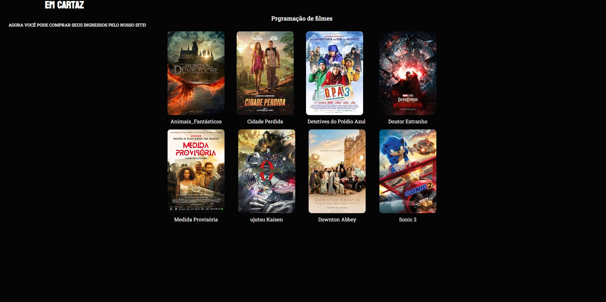

# Projeto Faculdade Web Site

### Ajustes e melhorias

O projeto ainda está em desenvolvimento e as próximas atualizações serão voltadas nas seguintes tarefas:

- [x] Layout
- [x] HTML/5 
- [x] CSS/3
- [x] JavaScript
- [x] Banco de Dados

> Está interface foi desenvolvida para  Web e cell 

## 🤝 Desenvolvedores

<table>
  <tr>
    <td >
      <a href="https://www.linkedin.com/in/isaiassouzasantos/">
         
        
          <b>Isaias souza</b>
        
      </a>
    </td>

<td>
      <a href="https://github.com/GuiIhermeLandim?tab=repositories">
         
        
          <b>Guilherme Alves</b>
        
      </a>
    </td>
    
<td>
      <a href="https://github.com/GuiIhermeLandim?tab=repositories">
         
        
          <b>Bruna Ferreira</b>
        
      </a>
    </td>

   
<td>
      <a href="https://github.com/GuiIhermeLandim?tab=repositories">
         
        
          <b>Eduardo gaspar</b>
        
      </a>
    </td>
    
<td>
      <a href="https://github.com/GuiIhermeLandim?tab=repositories">
         
        
          <b>Murilo</b>
        
      </a>
    </td>
    
 </tr>
  
</table>

